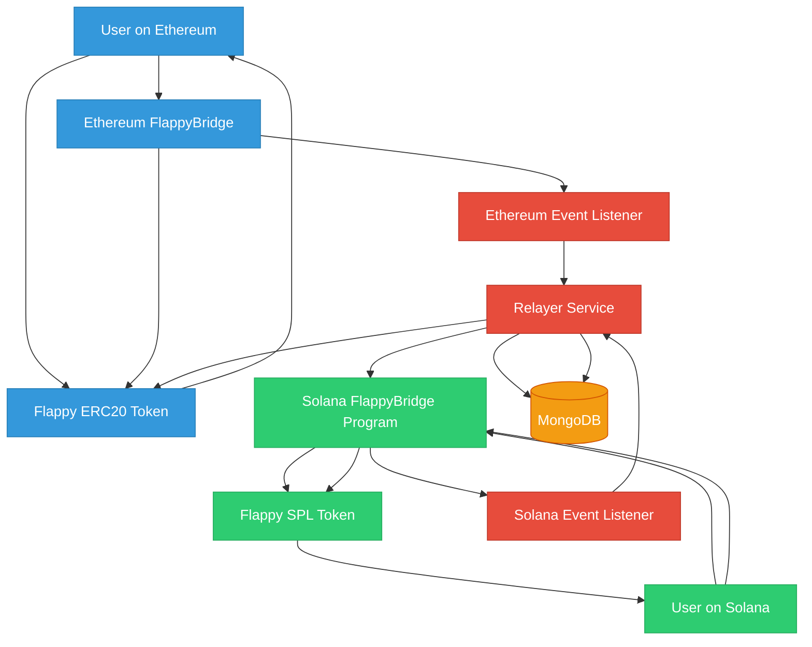

# Flappy Token Bridge

A simplified token bridge implementation between Solana (SVM) and Ethereum (EVM).

### Architecture

The project implements a token bridge system with the following components:

1. **EVM Side**:

   - `Flappy.sol`: ERC20 token with mint/burn capabilities
   - `FlappyBridge.sol`: Bridge contract that handles token locking and cross-chain requests

2. **Solana Side**:

   - `spl20`: SPL token implementation with mint/burn functionality
   - `FlappyBridge`: Bridge program that manages token transfers across chains

3. **Relayer**:
   - A service that monitors both chains for bridge events
   - Processes cross-chain token transfer requests
   - Authenticates and executes the minting on the destination chain

### Deployed Details

- Eth Flappy Token: [0xE6a10059f1206aCf2925Bbcc7dECD54AbD6DeFd1](sepolia.etherscan.io/address/0xE6a10059f1206aCf2925Bbcc7dECD54AbD6DeFd1)
- Eth Flappy Bridge: [0x56AD7aeD091C804D845F4F1a397E8dED41e61eb4](sepolia.etherscan.io/address/0x56AD7aeD091C804D845F4F1a397E8dED41e61eb4)
- Solana Flappy Token: [4QLR9Eu76BqdqqgLgK57ZNrTmUd9Fd8QYcqRFWWducUH](https://solscan.io/token/4QLR9Eu76BqdqqgLgK57ZNrTmUd9Fd8QYcqRFWWducUH?cluster=devnet)
- Solana Flappy Bridge: [8X3gPhhqv562jvPgK7Yj7VWwSjYjcsxUuedJKcic8Pwf](https://solscan.io/account/8X3gPhhqv562jvPgK7Yj7VWwSjYjcsxUuedJKcic8Pwf?cluster=devnet)

### How to test

```sh
cd relayer
cp .env.example .env
# Update the .env file with your private keys and RPC URLs
yarn solana:deposit-burn --amount 1 --destination 0x9FF0B97C9FAd35c74a22fb714b4fCA644d850C60
yarn evm:deposit-burn --amount 10 --destination 8X3gPhhqv562jvPgK7Yj7VWwSjYjcsxUuedJKcic8Pwf
```

### System Design


